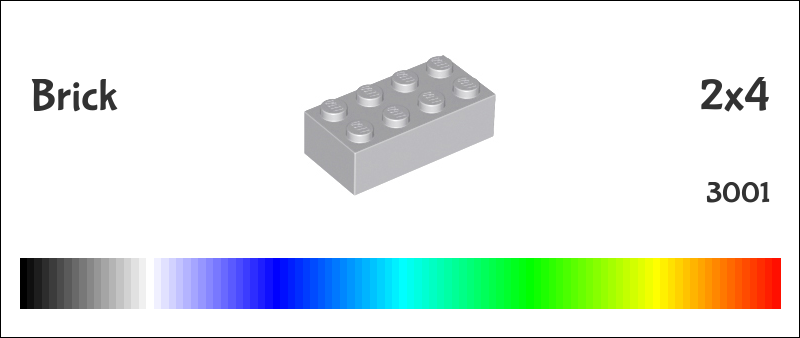
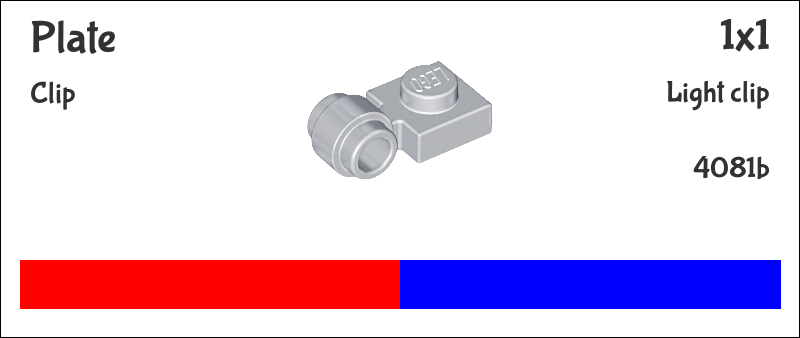
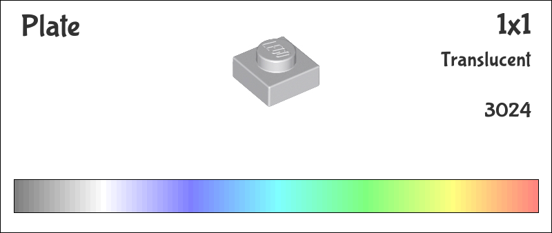

# legolabels
This is a simple script to create labels for bins for storing Lego blocks. 
I use Akro-Mills bins, so they're arranged with those in mind, but overall should be fairly flexible.

The results look generally something like:



Or, on a bin, something more like:


## Running

Run the script by doing something like:

```python3 generate.py -partNum 3001```

3001 is a 2x4 Lego brick. Replace that number with whatever part number you're wanting to use. [Bricklink](http://bricklink.com) is a good source for part numbers.

### Command parameters

Each parameter should start with a dash and then whatever option you're wanting to set.

| Option | Default | Notes |
|--|--|--|
| ```partNum``` | N/A | **Required**: Bricklink part number to make for label |
| ```o``` | \<partNum\>&nbsp;-&nbsp;\<colors\>.png Example: 3001&nbsp;-&nbsp;rainbow.png | Output filename |
| ```colours``` ```colors``` | rainbow | A list of color(s) for the label. Surround this in quotes and seprate by spaces.<br>For example:<br>```-colours 'red blue'``` |
| ```translucent``` | false | If set, will make the color bar look translucent. |
| ```width``` | 800 | Pixel width of the label. |
| ```height``` | 338 | Pixel height of the label. |
| ```itemType``` | Pulled automatically (example: 'Brick') | A text string to replace the default type of this part. |
| ```itemSubType``` | Pulled automatically (example: 'Round') | A text string to replace the subtype for this part (displayed directly below the type) |
| ```itemSize``` | Pulled automatically (example: '1x4') | A text string to replace the size of the part. |
| ```itemDescription``` | Pulled automatically (Example: 'With bottom tube', though usually blank) | A text string to replace the description of the part. |
| ```itemPartNum``` | ```partNum``` parameter | A text string to replace the part number (I use this to change it to 'Various' for bins with similar parts) |
| ```itemImageFile``` | Pulled automatically | An alternate image file to put on the label. Useful for very custom labels, parts without images available, or creating a "group" image. |
| ```fontFile``` | bubblegum.ttf | Font to use for label. Change with care since this can impact spacing. |


### Examples:
```python3 generate.py -partNum 4081b -colours "red blue" -itemSubType "Clip" -itemDescription "Light clip"```



```python3 generate.py -partNum 3024 -translucent -itemDescription "Translucent"```

